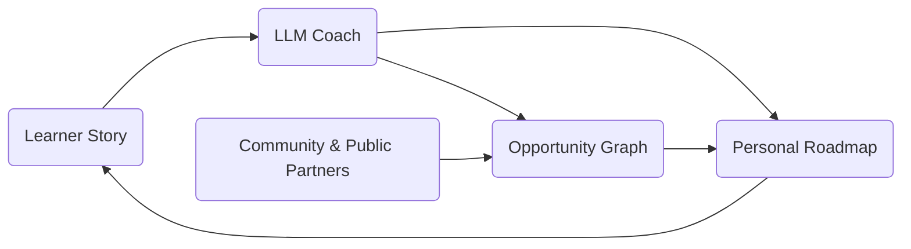

# PortoEdu MCP Server

PortoEdu is the AI coach we are building for teens and young adults in São Paulo’s periferias who juggle classes, bills, and dreams. 💛  
We align empathetic guidance with real opportunities so every learner can discover purpose, plot tangible next steps, and feel seen.

## Mission & Impact
- 🎯 **Focus**: students in ensino médio and early-career workers who don’t know how to bridge survival and aspiration.  
- 🧭 **Promise**: “You’re not alone.” PortoEdu listens, coaches, and connects each learner to the pathways that fit their reality.  
- 🌍 **Outcome**: reduced dropout, dignified work transitions, and hope that lasts beyond the first job contract.  
- 🤝 **Allies**: public schools, NGOs, and government programs that will plug into our opportunity graph.

## Who We Serve
- Youth from vulnerable communities in São Paulo starting or finishing ensino médio.  
- Teens who had to join the workforce and now need flexible study or training options.  
- First-job seekers who don’t know which credentials, apprenticeships, or financial aid they qualify for.

## Platform Journey



## Backend Vision
- **Conversational Coach**: a warm LLM persona that captures goals, constraints, and motivation.  
- **Opportunity Graph**: curated feeds of scholarships, vocational programs, public services, and entry-level jobs.  
- **Smart Matching**: AI-powered recommendation layer balancing eligibility rules, schedule limits, commute distance, and financial needs.  
- **Human Bridges**: integration points for mentors, teachers, and counselors to step in when human support matters most.  
- **Impact Loops**: continuous feedback from learners to improve recommendations and measure longitudinal outcomes.

## About This Repository
- This is our **experimental backend**—a modern MCP (Model Context Protocol) server written in R.  
- We built it to be more robust and customizable for richer future integrations, while we iterate quickly for the hackathon.  
- Today, it hosts the core service functions and a demo CSV-backed datastore so we can demonstrate flows end-to-end.  
- Tomorrow, it will orchestrate data pipelines, partner APIs, and analytics that power the PortoEdu coach experience.

## Quick Start

1. **Install R dependencies**:
   ```bash
   Rscript install.R
   ```
   Or manually: `install.packages("jsonlite")`

2. **Configure your AI assistant** - See `SETUP.md` for detailed instructions

3. **Start using the tools** with OpenAI.

## Server Implementations

Two MCP server versions are included:

### mcp_server_stdio.R (Recommended)
- Uses STDIO transport (standard input/output)
- Works directly with OpenAI AgentKit.
- Fewer dependencies (only requires `jsonlite`)

### mcp_server.R
- Uses HTTP transport via `mcptools` package
- Requires `mcptools` R package
- Good for HTTP/API-based integrations
- Can be accessed via network

## Available Tools

All tools work with CSV-based user storage in the `data/` directory:

### User Management
- **create_user** - Create a new user with name and ID
- **add_user_data** - Add or update custom data fields for a user
- **get_user** - Retrieve user information
- **delete_user** - Remove a user from the system

### Context/Conversation Management
- **add_user_context** - Append conversation history for a user
- **clear_user_context** - Clear all conversation history
- **get_user_context** - Retrieve conversation history

For detailed tool parameters and return values, see `SETUP.md`.

## Configuration

```json
{
  "mcpServers": {
    "portoedu": {
      "command": "Rscript",
      "args": ["/absolute/path/to/portoedu_back/mcp_server_stdio.R"],
      "env": {
        "PORTOEDU_DATA_DIR": "/absolute/path/to/portoedu_back/data"
      }
    }
  }
}
```

See `SETUP.md` for complete configuration instructions for all platforms.

## Requirements

- R (version 4.0 or higher)
- R package: `jsonlite` (required)
- R package: `mcptools` (optional, only for HTTP server version)

## Environment Variables

- `PORTOEDU_DATA_DIR` - Directory for storing user data and context files (default: `data/`)
- `MCP_HOST` - Server host for HTTP version (default: `127.0.0.1`)
- `MCP_PORT` - Server port for HTTP version (default: `3000`)

## Files

- `R/service.R` - Core R service functions
- `mcp_server_stdio.R` - STDIO-based MCP server (recommended)
- `mcp_server.R` - HTTP-based MCP server using mcptools
- `SETUP.md` - Detailed setup and configuration guide
- `install.R` - Installation helper script

## Development

To add new R functions as MCP tools:

1. Add your function to `R/service.R`
2. Register it in the appropriate `mcp_server*.R` file
3. Restart the MCP server
4. The new tool will be available to your AI assistant

Example from `mcp_server_stdio.R`:
```r
list(
  name = "my_new_tool",
  description = "What this tool does",
  inputSchema = list(
    type = "object",
    properties = list(
      param1 = list(type = "string", description = "Parameter description")
    ),
    required = c("param1")
  )
)
```

## Troubleshooting

See the "Troubleshooting" section in `SETUP.md` for common issues and solutions.

## License

See your repository license.
