<div align="center">

# 💛 PortoEdu MCP Server

### *Because every dream deserves a roadmap*

**The AI coach for teens and young adults in São Paulo's periferias**
*Bridging the gap between survival and aspiration, one conversation at a time*

---

[](https://www.r-project.org/)
[](https://modelcontextprotocol.io/)
[](.)

</div>

---

## 🌟 Why We Exist

In São Paulo's periferias, young people are **brilliant, resourceful, and full of potential**—but they're navigating a maze without a map. They're juggling:
- 📚 Classes that don't always connect to their reality
- 💰 Bills that can't wait
- ✨ Dreams that feel impossibly far away

**PortoEdu changes that.** We're building an AI coach that listens, understands, and helps every learner plot their next move—whether that's finding the right scholarship, landing their first job, or discovering a path they didn't know existed.

> *"You're not alone. We see you, and we're here to help you build the future you deserve."*

---

## 🎯 Our Mission in Action

<table>
<tr>
<td width="25%" align="center">

### 🎓 **Focus**
Students in ensino médio and early-career workers who need to bridge survival and aspiration

</td>
<td width="25%" align="center">

### 🧭 **Promise**
PortoEdu listens, coaches, and connects each learner to pathways that fit their reality

</td>
<td width="25%" align="center">

### 🌍 **Outcome**
Reduced dropout, dignified work transitions, and hope that lasts beyond the first paycheck

</td>
<td width="25%" align="center">

### 🤝 **Allies**
Public schools, NGOs, and government programs powering our opportunity graph

</td>
</tr>
</table>

---

## 👥 Who We Serve

<table>
<tr>
<td width="33%" align="center">

### 🎒 **The Students**
Youth from vulnerable communities in São Paulo starting or finishing ensino médio

</td>
<td width="33%" align="center">

### 💼 **The Workers**
Teens who had to join the workforce and need flexible study or training options

</td>
<td width="33%" align="center">

### 🚀 **The Dreamers**
First-job seekers discovering which credentials, apprenticeships, or aid they qualify for

</td>
</tr>
</table>

---

## 🗺️ The Journey: How PortoEdu Works

```mermaid
graph TB
    A[👤 Learner shares their story] --> B[🤖 AI Coach listens & understands]
    B --> C[🔍 Searches Opportunity Graph]
    C --> D[📊 Opportunity Graph<br/>Scholarships • Jobs • Programs]
    D --> E[🎯 Smart Matching Engine]
    E --> F[📋 Personalized Roadmap]
    F --> G[✨ Learner takes action]
    G -.feedback.-> B
    H[🤝 Community Partners<br/>Schools • NGOs • Government] -.data.-> D

    style A fill:#FFE5B4,stroke:#333,stroke-width:2px,color:#000
    style B fill:#B4E5FF,stroke:#333,stroke-width:2px,color:#000
    style C fill:#fff,stroke:#333,stroke-width:2px,color:#000
    style D fill:#FFB4E5,stroke:#333,stroke-width:2px,color:#000
    style E fill:#E5B4FF,stroke:#333,stroke-width:2px,color:#000
    style F fill:#B4FFB4,stroke:#333,stroke-width:2px,color:#000
    style G fill:#FFE5B4,stroke:#333,stroke-width:2px,color:#000
    style H fill:#FFDAB9,stroke:#333,stroke-width:2px,color:#000
```



---

## 🏗️ What Powers PortoEdu

Our backend isn't just code—it's the infrastructure of hope. Here's what makes it tick:

### 💬 **Conversational Coach**
A warm, empathetic LLM persona that truly listens—capturing goals, constraints, and the spark that keeps learners going.

### 🕸️ **Opportunity Graph**
A living, breathing network of scholarships, vocational programs, public services, and entry-level jobs curated specifically for periferias.

### 🎯 **Smart Matching Engine**
AI-powered recommendations that balance the real stuff: eligibility rules, schedule conflicts, commute distance, and financial needs.

### 🌉 **Human Bridges**
Integration points where mentors, teachers, and counselors can step in—because sometimes you need a human hand to hold.

### 🔄 **Impact Loops**
Continuous feedback from learners that helps us improve recommendations and measure what actually matters: long-term outcomes.

---

## 📦 About This Repository

> 🔬 **This is our experimental backend**—a modern MCP (Model Context Protocol) server written in R.

**Today:** We're hosting core service functions with a CSV-backed datastore, demonstrating end-to-end flows that show what's possible.

**Tomorrow:** This will orchestrate data pipelines, partner APIs, and analytics infrastructure that power every PortoEdu coaching conversation.

We chose R for its statistical power and data science capabilities—because matching learners to opportunities is both an art and a science.

---

## 🚀 Quick Start

Ready to run PortoEdu locally? Let's get you set up in 3 steps:

### 1️⃣ Install R dependencies

```bash
Rscript install.R
```

Or manually install:
```r
install.packages("jsonlite")
```

### 2️⃣ Configure your AI assistant

Check out [`SETUP.md`](SETUP.md) for detailed configuration instructions tailored to your platform.

### 3️⃣ Start coaching!

Connect with OpenAI and start using the tools to manage learner profiles and conversations.

---

## 🔧 Server Implementations

We've built **two flavors** of the MCP server to fit different integration needs:

<table>
<tr>
<td width="50%">

### ⭐ `mcp_server_stdio.R` (Recommended)

**Best for:** Direct AI integrations

✅ Uses STDIO transport (stdin/stdout)
✅ Works seamlessly with OpenAI AgentKit
✅ Minimal dependencies (just `jsonlite`)
✅ Lightweight and fast

</td>
<td width="50%">

### 🌐 `mcp_server.R`

**Best for:** Network-based integrations

✅ HTTP transport via `mcptools` package
✅ Network-accessible API endpoints
✅ Great for distributed systems
✅ Flexible integration options

</td>
</tr>
</table>

---

## 🛠️ Available Tools

All tools work with CSV-based user storage in the `data/` directory. Think of these as the building blocks for every coaching conversation:

<table>
<tr>
<td width="50%">

### 👤 User Management

| Tool | What it does |
|------|--------------|
| 🆕 **create_user** | Create a new learner profile with name and ID |
| ✏️ **add_user_data** | Add or update custom data fields (goals, constraints, etc.) |
| 🔍 **get_user** | Retrieve complete learner information |
| 🗑️ **delete_user** | Remove a user from the system |

</td>
<td width="50%">

### 💬 Context/Conversation Management

| Tool | What it does |
|------|--------------|
| 💾 **add_user_context** | Append conversation history for continuity |
| 🧹 **clear_user_context** | Clear all conversation history (fresh start) |
| 📖 **get_user_context** | Retrieve full conversation history |

</td>
</tr>
</table>

> 💡 **Need more details?** Check out [`SETUP.md`](SETUP.md) for detailed tool parameters and return values.

---

## ⚙️ Configuration

Here's a basic configuration example to get you started:

```json
{
  "mcpServers": {
    "portoedu": {
      "command": "Rscript",
      "args": ["/absolute/path/to/portoedu_back/mcp_server_stdio.R"],
      "env": {
        "PORTOEDU_DATA_DIR": "/absolute/path/to/portoedu_back/data"
      }
    }
  }
}
```

> 📚 **Full setup guide:** Check [`SETUP.md`](SETUP.md) for complete configuration instructions across all platforms.

---

## 📋 Requirements

### Essential
- 🔷 **R** (version 4.0 or higher)
- 📦 **jsonlite** package (required for all server versions)

### Optional
- 🌐 **mcptools** package (only needed for HTTP server version)

---

## 🌍 Environment Variables

Customize PortoEdu's behavior with these environment variables:

| Variable | Purpose | Default |
|----------|---------|---------|
| 📁 `PORTOEDU_DATA_DIR` | Directory for user data and context files | `data/` |
| 🏠 `MCP_HOST` | Server host for HTTP version | `127.0.0.1` |
| 🔌 `MCP_PORT` | Server port for HTTP version | `3000` |

---

## 📂 Repository Structure

Here's what lives where:

| File | Purpose |
|------|---------|
| 📘 `R/service.R` | Core R service functions—the heart of the system |
| ⭐ `mcp_server_stdio.R` | STDIO-based MCP server (recommended for most use cases) |
| 🌐 `mcp_server.R` | HTTP-based MCP server using mcptools |
| 📖 `SETUP.md` | Your comprehensive setup and configuration guide |
| 🚀 `install.R` | Installation helper script |
| 📁 `data/` | CSV-backed datastore for user profiles and context |

---

## 👨‍💻 Development Guide

Want to extend PortoEdu? Here's how to add new tools:

### Adding a New MCP Tool

**Step 1:** Add your function to `R/service.R`
```r
my_new_function <- function(param1, param2) {
  # Your logic here
  return(result)
}
```

**Step 2:** Register it in the appropriate `mcp_server*.R` file
```r
list(
  name = "my_new_tool",
  description = "What this tool does",
  inputSchema = list(
    type = "object",
    properties = list(
      param1 = list(type = "string", description = "Parameter description"),
      param2 = list(type = "number", description = "Another parameter")
    ),
    required = c("param1")
  )
)
```

**Step 3:** Restart the MCP server

**Step 4:** 🎉 Your new tool is now available to your AI assistant!

---

## 🔧 Troubleshooting

Running into issues? Don't worry—check the **"Troubleshooting"** section in [`SETUP.md`](SETUP.md) for common problems and solutions.

---

## 💝 Built With Heart

This project is built for the teens and young adults who deserve every opportunity to thrive. Every line of code, every function, every feature—it's all in service of making their journey a little easier, a little clearer, and a little more full of hope.

---

## 📜 License

See your repository license for usage terms.

---

<div align="center">

**💛 PortoEdu • Transforming dreams into roadmaps • 2025 💛**

*Made with ❤️ for São Paulo's periferias*

</div>
